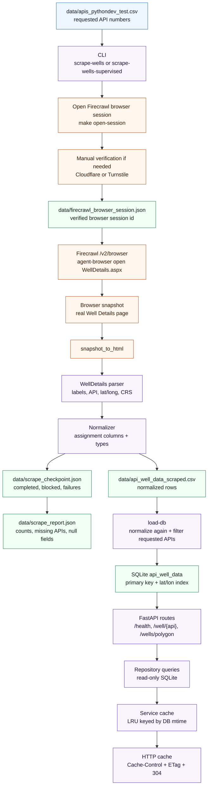

# SynMax Well Data API

This project ingests New Mexico oil and gas well data for a provided list of API
numbers, stores normalized records in SQLite, and exposes the data through a
small read-only FastAPI service.

The ingestion source is the official NM OCD Well Details page, for example:

```text
https://wwwapps.emnrd.nm.gov/OCD/OCDPermitting/Data/WellDetails.aspx?api=30-015-25325
```

## Infographic


Firecrawl is a web data platform that can load JavaScript-rendered pages,
return page HTML, and run managed browser sessions through an API. In this
project it acts as the scraping and browser automation layer between the Python
code and the official NM OCD website. Because the NM OCD pages can present
Cloudflare or Turnstile protection, the practical scrape workflow uses a live
Firecrawl browser session so a human can complete verification and the scraper
can continue from the verified session/profile.

## What This Repository Contains

- `app/main.py` - FastAPI application factory and ASGI entrypoint.
- `app/api/` - API routes, OpenAPI documentation constants, and HTTP cache helpers.
- `app/cli/` - command-line interface used by the `Makefile` for scraping,
  session management, and database loading.
- `app/services/` - ingestion pipeline, query services, and the Well Details
  scraping/parsing clients.
- `app/repositories/` - SQLite schema, create/load/query functions, and
  read-only connection helpers.
- `app/schemas/` - API request validation helpers.
- `app/utils/` - normalization and geospatial helpers.
- `data/apis_pythondev_test.csv` - input API numbers to scrape.
- `data/api_well_data_scraped.csv` - normalized scraped output CSV.
- `data/scrape_checkpoint.json` - resumable scraper state.
- `data/scrape_report.json` - latest scrape summary and data-quality report.
- `api_well_data.db` - local SQLite database file.
- `tests/` - pytest coverage for parsing, ingestion, normalization, repository
  behavior, CLI behavior, geospatial logic, and API routes.

## Stack And Tools

Runtime:

- Python 3.11+
- SQLite
- FastAPI
- Uvicorn
- Pydantic
- Shapely
- Firecrawl REST API for scraping and browser sessions

Developer tooling:

- `make` for common local commands
- `pytest` for tests
- `ruff` for linting
- Python standard-library `sqlite3`, `csv`, `html.parser`, and `urllib`

The Firecrawl integration is implemented directly with REST calls through
`urllib`; there is no Firecrawl Python SDK dependency.

## Quick Start From A Fresh Copy

1. Clone or fork the repository.

   ```bash
   git clone <your-repo-url>
   cd "Synmax Project"
   ```

2. Create a virtual environment and install the project.

   ```bash
   python3.11 -m venv .venv
   .venv/bin/pip install --upgrade pip
   .venv/bin/pip install -e ".[dev]"
   ```

3. Create your local environment file in the project root.

   If you do not already have a `.env` file, copy the example template:

   ```bash
   cp .env.example .env
   ```

   If you already have a `.env` file from another copy of the project, move or
   copy it into this repository's root folder. Then edit `.env` with your local
   values:

   ```bash
   FIRECRAWL_API_KEY=<your-firecrawl-key>
   NM_OCD_FIRECRAWL_PROFILE=nm-ocd
   NM_OCD_REQUEST_DELAY_SECONDS=7
   NM_OCD_BROWSER_TTL_SECONDS=3600
   NM_OCD_BROWSER_ACTIVITY_TTL_SECONDS=3600
   NM_OCD_BROWSER_WAIT_MS=5000
   SYNMAX_DATABASE_PATH=api_well_data.db
   ```

4. If you already have `data/api_well_data_scraped.csv`, load it into SQLite.

   ```bash
   make load-db
   ```

   If you do not have that CSV yet, generate it first and then load the database:

   ```bash
   make ingest
   ```

   If the official site shows protection or the scrape stops on protected
   pages, use the supervised flow. It opens a new browser session, waits for
   manual verification, and resumes from the checkpoint:

   ```bash
   make ingest-supervised
   ```

5. Start the API.

   ```bash
   make start
   ```

6. Test the service.

   ```bash
   curl http://127.0.0.1:8000/health
   curl http://127.0.0.1:8000/well/30-015-25325
   curl 'http://127.0.0.1:8000/wells/polygon?points=32.81,-104.19;32.66,-104.32;32.54,-104.24;32.50,-104.03;32.73,-104.01;32.79,-103.91;32.84,-104.05'
   ```

OpenAPI docs are available at:

```text
http://127.0.0.1:8000/docs
```

## Common Commands

| Command | What it does |
| --- | --- |
| `make start` | Starts Uvicorn with `app.main:app --reload`. |
| `make open-session` | Creates a live Firecrawl browser session for manual verification. |
| `make check-session` | Confirms the active session/profile can parse a real Well Details page. |
| `make scraping` | Scrapes Well Details pages into `data/api_well_data_scraped.csv`. |
| `make scraping-supervised` | Scrapes and automatically opens new supervised sessions when protection blocks progress. |
| `make load-db` | Recreates and loads `api_well_data.db` from the scraped CSV. |
| `make ingest` | Runs `make scraping` and then `make load-db`. |
| `make ingest-supervised` | Runs supervised scraping and then loads SQLite. |
| `make close-session` | Closes the active Firecrawl browser session so profile state can be saved. |
| `make reset-ingest` | Deletes scrape artifacts and clears the local database table. |
| `make test` | Runs pytest. |
| `make lint` | Runs ruff. |

Direct CLI examples:

```bash
.venv/bin/python -m app.cli scrape-wells --help
.venv/bin/python -m app.cli scrape-wells-supervised --help
.venv/bin/python -m app.cli load-db --help
```

## Full Scrape Workflow

Use this path when you need to regenerate the scraped CSV from the official
NM OCD site.

1. Open a Firecrawl browser session.

   ```bash
   make open-session
   ```

2. Open the printed interactive Firecrawl URL.

3. If the official site shows a Cloudflare or Turnstile challenge, complete it
   manually in the Firecrawl browser.

4. Wait until real Well Details data is visible.

5. Keep the session open and verify the parser can read through it.

   ```bash
   make check-session
   ```

6. Run ingestion.

   ```bash
   make ingest
   ```

7. Close the session after ingestion finishes.

   ```bash
   make close-session
   ```

For longer or fragile scrapes, prefer the supervised command:

```bash
make ingest-supervised
```

The supervised command stops quickly when protected or failed pages appear,
closes the stale browser session, rotates `NM_OCD_FIRECRAWL_PROFILE` in `.env`
when the configured profile follows the expected numbered pattern, opens a new
Firecrawl browser session, prints the live URL, waits for manual verification,
and resumes from `data/scrape_checkpoint.json`.

## Architecture

The project is intentionally split into small layers:

1. CLI layer: parses commands, loads `.env`, chooses Firecrawl client strategy,
   and starts scrape/load operations.
2. Scraping layer: fetches `WellDetails.aspx`, detects protected pages, retries
   failures, writes checkpoint/report/CSV outputs, and resumes safely.
3. Parsing layer: extracts assignment fields from the official page HTML or
   from a Firecrawl browser accessibility snapshot.
4. Normalization layer: maps source labels and export aliases into the exact
   `api_well_data` schema, coerces numeric fields, and normalizes API numbers.
5. Repository layer: creates the SQLite table/indexes, upserts rows by API, and
   provides read queries.
6. API layer: serves read-only lookup and polygon-search endpoints with
   process-level and HTTP caching.

## Data Flow



## Firecrawl Integration Details

The Firecrawl code lives in `app/services/well_details/clients.py`, with CLI
orchestration in `app/cli/commands.py`.

There are three client classes:

- `FirecrawlWellDetailsClient` calls `POST https://api.firecrawl.dev/v2/scrape`.
  It requests `html` and `rawHtml`, disables main-content-only extraction, sends
  a browser-like user agent, waits for the page, disables Firecrawl cache storage,
  and optionally attaches a named profile with `saveChanges: true`.
- `FirecrawlBrowserClient` calls the Firecrawl browser endpoints. It creates a
  browser session, executes Node or bash browser commands, and closes the
  session.
- `FirecrawlBrowserSessionWellDetailsClient` uses an already-open browser
  session. It runs `agent-browser open <url>`, waits, captures an accessibility
  snapshot, and converts that snapshot into parser-friendly HTML.

The CLI chooses the browser-session client first when
`data/firecrawl_browser_session.json` exists and is not marked closed. If there
is no active session, it falls back to `/v2/scrape` with the configured
`NM_OCD_FIRECRAWL_PROFILE`.

### Why A Browser Session Is Needed

The official NM OCD site can return Cloudflare or Turnstile protection instead
of well data. A normal scrape may receive a challenge page such as "Just a
moment" or "Verification Failed". The project does not try to bypass that
challenge in code. Instead, it opens a Firecrawl live browser session so a human
can complete the verification step. Once the real Well Details page is visible,
the scraper can use that same browser session or saved Firecrawl profile state.

The important pieces are:

- `NM_OCD_FIRECRAWL_PROFILE` names the persistent Firecrawl profile that can
  retain cookies/session state.
- `make open-session` creates a live browser session using that profile.
- `make check-session` verifies that the active session/profile returns actual
  Well Details data and that the parser can extract fields.
- `make close-session` closes the session so Firecrawl can save profile changes.

### Why `firecrawl_browser_session.json` Exists

`data/firecrawl_browser_session.json` stores the active Firecrawl browser
session metadata returned by Firecrawl. The CLI needs it because later commands
must know which browser session ID to use.

It usually contains:

- the Firecrawl browser session `id`
- the interactive live-view URL
- the opened Well Details URL
- the profile name
- whether the session was closed
- any close error encountered during cleanup

This file is local runtime state and is ignored by git. It should not be
committed. If it points at an expired or closed browser session, run
`make close-session` if possible, delete the stale file if necessary, and open a
new session.

### Why `scrape_checkpoint.json` Exists

`data/scrape_checkpoint.json` makes long scrapes resumable. The scraper updates
it after every attempted API number, so an interruption does not lose all work.

It has three main sections:

- `completed` - normalized records keyed by digit-only API number
- `blocked` - APIs that returned protected/challenge pages
- `failures` - APIs that failed because of Firecrawl, browser, parse, or value
  errors

On the next run, the scraper skips completed APIs unless `--no-resume` is used.
The CSV and report are rebuilt from this checkpoint, which keeps the artifacts
consistent.

### Why `sleep_with_heartbeat()` Exists

`sleep_with_heartbeat()` is the scraper's pacing helper. It breaks the configured
request delay into short one-second sleeps instead of one long sleep, which makes
long scraping runs easier to interrupt and easier to test while still respecting
`NM_OCD_REQUEST_DELAY_SECONDS`.

### Why `scrape_report.json` Exists

`data/scrape_report.json` is the human-readable scrape summary. It helps decide
whether the scrape is complete enough to load or whether the session/profile
needs attention.

It includes:

- source name, currently `WellDetails.aspx`
- requested, scraped, blocked, failed, and missing counts
- missing API numbers
- blocked API numbers and reasons
- parse failures and reasons
- remaining null counts by assignment column
- stopped reason, if the scraper stopped early

## WellDetails.aspx Findings

The page accepts hyphenated API numbers, and the code can build URLs for both
10-digit and 14-digit API forms:

- `3001525325` -> `30-015-25325`
- `30015456780000` -> `30-015-45678-0000`

The parser looks for the main data area and labels used by the official page:

- page data area: `id="datapane"` or visible "General Well Information"
- labels: `span` elements with `fw-bold`
- values: `span` elements with `text-mute`
- API number: hidden `id="API"` input or a hyphenated API in page text
- coordinates: `Lat / Long` in the form `latitude,longitude CRS`

This is true for the Well Details markup the parser is built around. The HTML
parser in `app/services/well_details/parser.py` reads the label/value pairs from
the page and uses `LABEL_TO_COLUMN` to map official page labels such as
`Direction`, `Single / Multi Compl`, `Spud`, and `True Vertical Depth` into the
project's assignment columns. If the scraper is using a live browser session,
the same module first converts the Firecrawl accessibility snapshot into
parser-friendly HTML, then applies the same parsing logic.

The second mapping pass happens in `app/utils/normalize.py`. That file contains
`FIELD_MAPPING`, which handles source/export aliases such as `Current Operator`
to `Operator`, `Type` to `Well Type`, `Elevation` to `GL Elevation`, and
`Projection` to `CRS`. It also normalizes API numbers, converts numeric fields,
and guarantees every row has the exact `api_well_data` column shape before the
CSV is written or SQLite is loaded.

The parser removes leading operator codes like `[371838] DJR OPERATING, LLC`,
normalizing the operator to `DJR OPERATING, LLC`.

Data quality depends on the official page. The scraper records
missing values as `null` instead of inventing data. Use `scrape_report.json` and
its `remaining_null_columns` section to see where source data is sparse.

The parser explicitly treats protection-only pages as failures. If the page
contains Cloudflare, Turnstile, "Just a moment", "Verification Failed", or
"Please use our official API instead of scraping this page" without real well
data, the scraper raises `ProtectedPageError` and records the API under
`blocked`.

## Scraping Failure Modes

Scraping can fail or stop for several reasons:

- Cloudflare or Turnstile returns a challenge page instead of `WellDetails.aspx`
  data.
- The Firecrawl profile has not been verified yet.
- The browser session TTL or inactivity TTL expires.
- `data/firecrawl_browser_session.json` points to a stale, closed, or invalid
  session.
- The official site invalidates cookies or changes its protection behavior.
- Requests are paced too aggressively and trigger protection; increase
  `NM_OCD_REQUEST_DELAY_SECONDS`.
- Firecrawl rate limits the account or returns quota errors, commonly HTTP 429.
- The browser snapshot is incomplete or does not include "General Well
  Information".
- The database is locked during load because the API, a DB viewer, or another
  process has the SQLite file open for writing.

### Possible Security Triggers

These are likely reasons the official site may decide a scrape looks
untrusted, even when the scraper is adding delays between requests:

- Browser/profile trust, not only timing. Firecrawl `/scrape` may not carry the
  same verified browser state as the live browser session, or the saved
  `NM_OCD_FIRECRAWL_PROFILE` cookies/session may have expired.
- IP or proxy reputation. `proxy: auto` can rotate through datacenter or proxy
  IPs that the site distrusts, independent of request spacing.
- Sequential API-number pattern. Scraping many `WellDetails.aspx` URLs in order
  can look automated even with longer waits.

Recommended recovery path:

```bash
make open-session
make check-session
make ingest-supervised
make close-session
```

If the session file is stale and cannot be closed, remove only the ignored
session file and open a fresh session:

```bash
rm -f data/firecrawl_browser_session.json
make open-session
```

## Data Loading And Normalization

The database load path is:

```bash
make load-db
```

The Makefile runs:

```bash
.venv/bin/python -m app.cli load-db --replace
```

That command:

1. Reads requested API numbers from `data/apis_pythondev_test.csv`.
2. Reads source records from `data/api_well_data_scraped.csv`.
3. Normalizes each source row with `app/utils/normalize.py`.
4. Filters out records whose API is not in the requested API set.
5. Sorts rows by normalized API.
6. Recreates the `api_well_data` table when `--replace` is used.
7. Upserts rows by `API`.

Normalization rules:

- API numbers are stored as digit-only text, preserving leading zeroes.
- Empty strings become `None`/SQLite `NULL`.
- `GL Elevation`, `KB Elevation`, `DF Elevation`, and `TVD` are coerced to
  integers when possible.
- `Latitude` and `Longitude` are coerced to floats.
- Existing assignment-column names are preferred over source aliases.
- Export/source aliases are mapped into assignment columns.
- `Surface Location` can be built from location pieces when it is missing.

Important alias mappings:

| Source field | Target column |
| --- | --- |
| `Current Operator` | `Operator` |
| `Type` | `Well Type` |
| `Direction` | `Directional Status` |
| `Single / Multi Compl` | `Single/Multiple Completion` |
| `Projection` | `CRS` |
| `Lat / Long CRS` | `CRS` |
| `True Vertical Depth` | `TVD` |
| `Elevation` | `GL Elevation` |
| `Kelly Bushing` | `KB Elevation` |
| `Drilling Floor` | `DF Elevation` |
| `Spud` or `Spud Date` | `Spud Date` |

When `Surface Location` is absent, the normalizer builds it from any available
location fields such as `Unit Letter`, `Section`, `Township`, `Range`, `Footages`,
`Footage NS`, `NS Indicator`, `Footage EW`, and `EW Indicator`.

## Database Schema And Indexes

The SQLite table is intentionally named `api_well_data` and uses the assignment's
exact column names, including spaces and the slash in
`Single/Multiple Completion`. Because of those names, SQL queries must quote the
columns.

The project-created command path is:

```bash
make load-db
```

Equivalent direct CLI command:

```bash
.venv/bin/python -m app.cli load-db \
  --source-csv data/api_well_data_scraped.csv \
  --database api_well_data.db \
  --replace
```

Equivalent raw SQLite table/index SQL:

```sql
CREATE TABLE IF NOT EXISTS api_well_data (
    "Operator" TEXT,
    "Status" TEXT,
    "Well Type" TEXT,
    "Work Type" TEXT,
    "Directional Status" TEXT,
    "Multi-Lateral" TEXT,
    "Mineral Owner" TEXT,
    "Surface Owner" TEXT,
    "Surface Location" TEXT,
    "GL Elevation" INTEGER,
    "KB Elevation" INTEGER,
    "DF Elevation" INTEGER,
    "Single/Multiple Completion" TEXT,
    "Potash Waiver" TEXT,
    "Spud Date" TEXT,
    "Last Inspection" TEXT,
    "TVD" INTEGER,
    "API" TEXT PRIMARY KEY NOT NULL,
    "Latitude" REAL,
    "Longitude" REAL,
    "CRS" TEXT
);

CREATE INDEX IF NOT EXISTS idx_api_well_data_lat_lon
    ON api_well_data ("Latitude", "Longitude");
```

If you want to create the schema manually:

```bash
sqlite3 api_well_data.db <<'SQL'
CREATE TABLE IF NOT EXISTS api_well_data (
    "Operator" TEXT,
    "Status" TEXT,
    "Well Type" TEXT,
    "Work Type" TEXT,
    "Directional Status" TEXT,
    "Multi-Lateral" TEXT,
    "Mineral Owner" TEXT,
    "Surface Owner" TEXT,
    "Surface Location" TEXT,
    "GL Elevation" INTEGER,
    "KB Elevation" INTEGER,
    "DF Elevation" INTEGER,
    "Single/Multiple Completion" TEXT,
    "Potash Waiver" TEXT,
    "Spud Date" TEXT,
    "Last Inspection" TEXT,
    "TVD" INTEGER,
    "API" TEXT PRIMARY KEY NOT NULL,
    "Latitude" REAL,
    "Longitude" REAL,
    "CRS" TEXT
);

CREATE INDEX IF NOT EXISTS idx_api_well_data_lat_lon
    ON api_well_data ("Latitude", "Longitude");
SQL
```

Why the indexes matter:

- `"API" TEXT PRIMARY KEY` creates SQLite's primary-key index. In this database,
  SQLite exposes that index as `sqlite_autoindex_api_well_data_1`. The
  `/well/{api_number}` route normalizes the public API number and queries
  `api_well_data` by `"API"`, so the primary-key index supports single well
  lookups. The loader also relies on the same constraint for
  `ON CONFLICT("API") DO UPDATE` upserts.
- `idx_api_well_data_lat_lon` supports the polygon endpoint. The API first uses
  a latitude/longitude bounding-box query to reduce candidate rows, then Shapely
  performs exact polygon coverage checks. This avoids running geometry logic
  against every row in the table.

## API Behavior

### `GET /health`

Checks whether the configured SQLite database can be opened read-only and the
`api_well_data` table can be queried.

```bash
curl http://127.0.0.1:8000/health
```

### `GET /well/{api_number}`

Returns one well by API number.

```bash
curl http://127.0.0.1:8000/well/30-015-25325
```

Public API numbers can be hyphenated or digit-only:

- valid: `30-015-25325`
- valid: `3001525325`
- valid: `30-015-45678-0000`
- valid: `30015456780000`
- invalid: `30015`

Invalid API number formats return `422`.

The route normalizes hyphenated values like `30-015-25325` to `3001525325`
before querying SQLite.

### `GET /wells/polygon`

Returns sorted API numbers whose coordinates are inside or on the boundary of a
polygon.

```bash
curl 'http://127.0.0.1:8000/wells/polygon?points=32,-105;33,-105;33,-104;32,-104'
```

Rules:

- `points` must be semicolon-separated `lat,lon` pairs.
- At least three distinct coordinate pairs are required.
- The polygon is closed automatically when the first and last point differ.
- Latitude must be between `-90` and `90`.
- Longitude must be between `-180` and `180`.
- Self-intersecting or zero-area polygons are rejected.
- Boundary points are included.

Invalid or missing `points` values return `422`.

## Caching

Caching is included because this API is read-heavy and the same well or polygon
queries can be requested repeatedly. With a small CSV this is not strictly
necessary, but it is a useful engineering choice if the data grows, if polygon
searches become expensive, or if multiple clients call the same endpoints. The
goal is to reduce repeated SQLite reads and repeated Shapely geometry checks
without making the data stale after a reload.

There are two cache layers:

1. Service-level LRU cache in `app/services/well_queries.py`.
   Single-well lookups and polygon search results are cached in process. The
   database file modification time is part of the cache key, so running
   `make load-db` and writing a new SQLite file naturally invalidates old
   cached results. This gives the API a fast path for repeated reads while still
   keeping the implementation simple and safe for a local SQLite-backed service.
2. HTTP cache headers in `app/api/cache.py`.
   Successful read responses include:

   ```text
   Cache-Control: public, max-age=300
   ETag: "<sha256-of-response-json>"
   ```

The HTTP cache layer helps clients and browsers avoid downloading the same JSON
again. Clients can send `If-None-Match`; if the response has not changed, the
API returns `304 Not Modified`. This is especially useful when the API is used
by a frontend, dashboard, or repeated script that refreshes the same well or map
area.

## Local Development Checks

Run tests:

```bash
make test
```

Run lint:

```bash
make lint
```

Check the database schema:

```bash
sqlite3 api_well_data.db '.schema api_well_data'
```

Count loaded rows:

```bash
sqlite3 api_well_data.db 'SELECT COUNT(*) FROM api_well_data;'
```

## Troubleshooting

| Symptom | What to do |
| --- | --- |
| `FIRECRAWL_API_KEY is required` | Add your key to `.env` or pass `--env-file`. |
| `Profile is not verified yet for NM OCD pages` | Run `make open-session`, complete the official site challenge in the live browser, then run `make check-session`. |
| `Scrape incomplete` | Inspect `data/scrape_report.json`. If `blocked_count` is nonzero or `stopped_reason` mentions protected pages, refresh the Firecrawl session and resume with `make ingest-supervised`. |
| `Browser session returned no page snapshot` | The saved browser session may have expired or the snapshot did not load the data pane. Open a new session and rerun `make check-session`. |
| `HTTP 429 Too Many Requests` | Firecrawl rate limited the account. Wait, check quota/concurrency, and resume from the checkpoint later. |
| `Database unavailable` | Confirm `SYNMAX_DATABASE_PATH` points to an existing SQLite file and that the process has read permission. |
| `api_well_data.db is locked` | Stop `make start`, close DB viewers, and make sure no other load process is writing before running `make load-db` or `make reset-ingest`. |

## Security And Repository Hygiene

- Keep `.env` local. It is ignored by git.
- Do not commit Firecrawl API keys.
- Do not commit `data/firecrawl_browser_session.json`; it is ignored and may
  contain live session metadata.
- Treat scraped data artifacts as generated outputs. If you regenerate them,
  review `scrape_report.json` before loading or committing data changes.
- The scraper does not automatically solve Cloudflare or Turnstile challenges.
  Manual verification is required when the official site asks for it.
